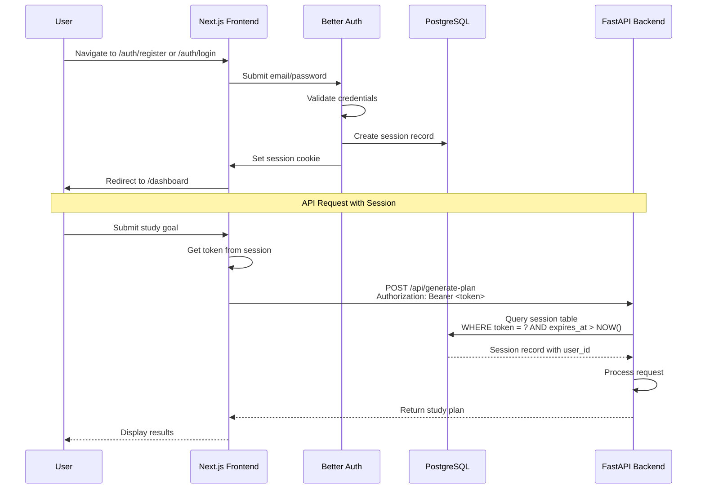
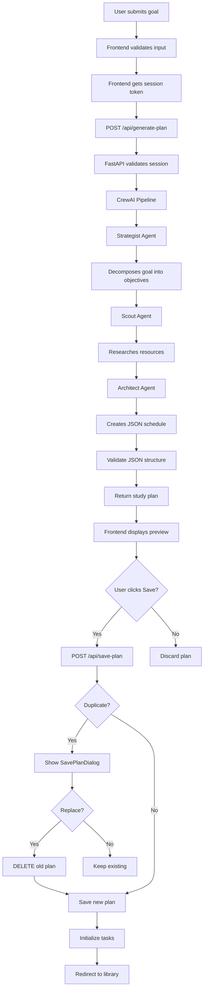
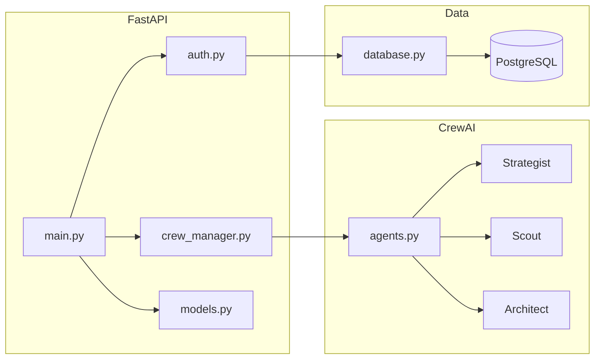
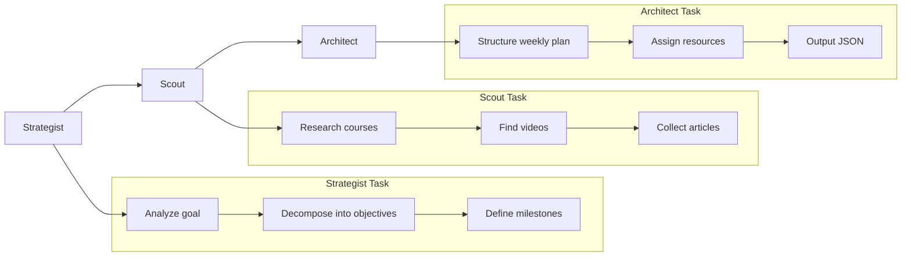
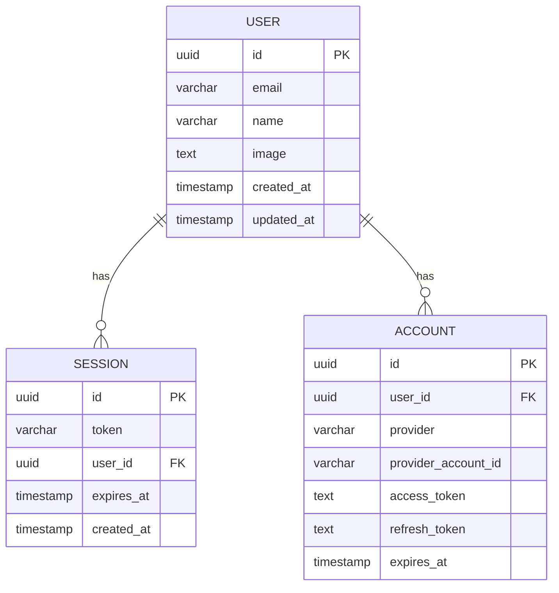

# Architecture Documentation

Technical deep-dive into the Autonomous Study Planner system architecture.

## System Overview

The Autonomous Study Planner is a full-stack application that combines a Next.js frontend with a FastAPI backend, using CrewAI agents to generate personalized study plans. The system uses PostgreSQL as a shared session store between frontend and backend authentication.

### Design Principles

1. **Shared Session Store** - Both frontend and backend read from the same PostgreSQL session table
2. **Stateless Backend** - FastAPI doesn't maintain session state; validates tokens against database
3. **Multi-Agent AI** - CrewAI coordinates specialized agents for different planning tasks
4. **Clean Separation** - Frontend handles UI/auth, backend handles business logic/AI

## Authentication Flow

The system uses Better Auth for email/password authentication with a shared PostgreSQL session store.



### Session Verification Flow

1. **Frontend stores session** - Better Auth creates a session record in PostgreSQL and sets a cookie
2. **Token extraction** - Frontend reads session token from `/api/auth/session` endpoint
3. **Bearer token** - Frontend sends requests with `Authorization: Bearer <token>` header
4. **Backend validation** - [`get_session_by_token()`](backend/database.py:20) queries PostgreSQL
5. **User identification** - Backend extracts `user_id` from valid session record

### Session Table Schema

```sql
CREATE TABLE session (
    id UUID PRIMARY KEY DEFAULT gen_random_uuid(),
    token VARCHAR(255) UNIQUE NOT NULL,
    user_id UUID NOT NULL REFERENCES "user"(id),
    expires_at TIMESTAMP NOT NULL,
    created_at TIMESTAMP DEFAULT NOW(),
    updated_at TIMESTAMP DEFAULT NOW()
);

-- Index for fast token lookups
CREATE INDEX idx_session_token ON session(token);
CREATE INDEX idx_session_expires ON session(expires_at);
```

### Auth Components

| Component | File | Purpose |
|-----------|------|---------|
| Better Auth Config | [`frontend/src/lib/auth.ts`](frontend/src/lib/auth.ts) | Initializes auth with PostgreSQL pool |
| Auth Handler | [`frontend/src/app/api/auth/[...all]/route.ts`](frontend/src/app/api/auth/[...all]/route.ts) | API route for auth endpoints |
| Session Verification | [`backend/auth.py`](backend/auth.py) | FastAPI dependency for token validation |
| Database Queries | [`backend/database.py`](backend/database.py) | PostgreSQL session/user queries |

## Data Flow

### Study Plan Generation Flow



### Study Plan Save/Delete Data Flow

```mermaid
flowchart TD
    subgraph "Save Flow"
        SF1[User clicks Save] --> SF2[Check existing plan]
        SF2 --> SF3{Duplicate?}
        SF3 -->|Yes| SF4[Show confirmation dialog]
        SF4 --> SF5{User confirms?}
        SF5 -->|Yes| SF6[Delete existing plan]
        SF6 --> SF7[Insert new plan]
        SF3 -->|No| SF7
        SF7 --> SF8[Initialize task records]
        SF8 --> SF9[Return plan_id]
    end
    
    subgraph "Delete Flow"
        DF1[User clicks Delete] --> DF2[Show confirmation dialog]
        DF2 --> DF3{User confirms?}
        DF3 -->|Yes| DF4[DELETE FROM study_plans]
        DF4 --> DF5[Cascade delete tasks]
        DF3 -->|No| DF6[Cancel operation]
    end
    
    subgraph "Task Update Flow"
        TF1[User toggles task] --> TF2[PUT /api/study-plans/{id}/tasks/{task_id}]
        TF2 --> TF3[Update is_completed]
        TF3 --> TF4[Update completed_at timestamp]
        TF4 --> TF5[Return updated task]
        TF5 --> TF6[Refresh stats]
    end
```

### Study Plan View Flow

```mermaid
flowchart TD
    A[Navigate to /dashboard/plans] --> B[Fetch user's plans]
    B --> C[Display StudyPlanLibrary]
    C --> D{User selects plan}
    D --> E[Navigate to /dashboard/plan/{id}]
    E --> F[Fetch plan details]
    F --> G[Fetch task completions]
    F --> H[Fetch completion stats]
    G --> I[Display StudyPlanDetail]
    H --> I
    I --> J[Render WeekCard components]
    J --> K[User toggles task completion]
    K --> L[Update task in database]
    L --> M[Update local state]
    M --> N[Recalculate progress]
```

### Request/Response Cycle

**1. User Input**
```typescript
// frontend/src/components/GoalForm.tsx
const handleSubmit = (goal: string, weeks: number) => {
  onSubmit(goal.trim(), weeks);
};
```

**2. API Request**
```typescript
// frontend/src/lib/api.ts
export async function generatePlan(goal: string, weeks: number, token: string) {
  const res = await fetch(`${BACKEND_URL}/api/generate-plan`, {
    method: 'POST',
    headers: {
      'Content-Type': 'application/json',
      'Authorization': `Bearer ${token}`,
    },
    body: JSON.stringify({ goal, weeks }),
  });
  return res.json();
}
```

**3. Session Validation**
```python
# backend/auth.py
async def get_current_user(authorization: HTTPAuthorizationCredentials = Depends(security)) -> str:
    token = authorization.credentials
    session = get_session_by_token(token)
    if not session:
        raise HTTPException(status_code=401, detail="Invalid or expired session token")
    return session.get("user_id")
```

**4. CrewAI Execution**
```python
# backend/crew_manager.py
crew = create_study_plan_crew(goal, weeks)
result = crew.kickoff()
study_plan = extract_json_from_output(result.raw)
```

**5. Response Validation**
```python
# backend/models.py
class StudyPlan(BaseModel):
    goal: str
    weeks: int
    milestones: List[Milestone]

# Validation happens automatically via FastAPI
return GeneratePlanResponse(success=True, plan=StudyPlan(**plan_data))
```

## Component Interaction

### Frontend Components

```mermaid
flowchart LR
    subgraph "Next.js App"
        P[page.tsx] --> GF[GoalForm]
        P --> D[Dashboard]
        P --> AB[AuthButtons]
        D --> T[Timeline]
        
        subgraph "Dashboard Routes"
            GEN[generator/page.tsx] --> SPG[StudyPlanGenerator]
            PLANS[plans/page.tsx] --> SPL[StudyPlanLibrary]
            DETAIL[plan/[id]/page.tsx] --> SPD[StudyPlanDetail]
        end
        
        SPG --> SPDIALOG[SavePlanDialog]
        SPL --> DELDIALOG[DeleteConfirmationDialog]
        SPD --> WC[WeekCard]
    end
    
    subgraph "Lib"
        API[api.ts]
        AUTH[auth.ts]
    end
    
    P --> API
    AB --> AUTH
    GF --> API
    SPG --> API
    SPL --> API
    SPD --> API
    WC --> API
```

| Component | Responsibility |
|-----------|----------------|
| [`page.tsx`](frontend/src/app/page.tsx) | Main page, state management, auth check |
| [`GoalForm.tsx`](frontend/src/components/GoalForm.tsx) | Input form for goal and duration |
| [`Dashboard.tsx`](frontend/src/components/Dashboard.tsx) | Displays plan or error states |
| [`Timeline.tsx`](frontend/src/components/Timeline.tsx) | Visual timeline of milestones |
| [`AuthButtons.tsx`](frontend/src/components/AuthButtons.tsx) | Sign in/out UI |
| [`StudyPlanGenerator.tsx`](frontend/src/components/StudyPlanGenerator.tsx) | Study plan generation interface with preview |
| [`StudyPlanLibrary.tsx`](frontend/src/components/StudyPlanLibrary.tsx) | List view of all saved plans |
| [`StudyPlanDetail.tsx`](frontend/src/components/StudyPlanDetail.tsx) | Detailed plan view with progress tracking |
| [`SavePlanDialog.tsx`](frontend/src/components/SavePlanDialog.tsx) | Duplicate detection and save confirmation |
| [`DeleteConfirmationDialog.tsx`](frontend/src/components/DeleteConfirmationDialog.tsx) | Delete confirmation with plan details |
| [`WeekCard.tsx`](frontend/src/components/WeekCard.tsx) | Weekly milestone card with tasks and resources |
| [`api.ts`](frontend/src/lib/api.ts) | Backend API client |
| [`auth.ts`](frontend/src/lib/auth.ts) | Better Auth configuration |

### Backend Components



| Component | Responsibility |
|-----------|----------------|
| [`main.py`](backend/main.py) | FastAPI app, route definitions, CORS |
| [`auth.py`](backend/auth.py) | Bearer token validation dependency |
| [`crew_manager.py`](backend/crew_manager.py) | CrewAI orchestration and JSON extraction |
| [`agents.py`](backend/agents.py) | Agent definitions with roles and tools |
| [`models.py`](backend/models.py) | Pydantic request/response models |
| [`database.py`](backend/database.py) | PostgreSQL connection, session queries, study plan CRUD, task operations |

## Frontend Routes

| Route | Component | Description |
|-------|-----------|-------------|
| `/dashboard` | Dashboard | Overview with quick actions |
| `/dashboard/generator` | StudyPlanGenerator | Create new study plans |
| `/dashboard/plans` | StudyPlanLibrary | Browse all saved plans |
| `/dashboard/plan/[id]` | StudyPlanDetail | View and track specific plan |

### Route Protection

All dashboard routes require authentication:

```typescript
// frontend/src/app/dashboard/*/page.tsx
const checkAuthStatus = async () => {
  const res = await fetch('/api/auth/session');
  if (res.ok) {
    const session = await res.json();
    if (session?.user) {
      setUser(session.user);
      setToken(session.session.token);
    } else {
      router.push('/auth/login');
    }
  } else {
    router.push('/auth/login');
  }
};
```

## CrewAI Agent Architecture

### Agent Pipeline



### Agent Configuration

**Strategist Agent** ([`create_strategist_agent()`](backend/agents.py:29))
```python
Agent(
    role="Academic Strategist",
    goal="Decompose academic goals into clear, actionable learning objectives",
    backstory="Expert in curriculum design and learning pathway creation...",
    llm=gemini_llm,
)
```

**Scout Agent** ([`create_scout_agent()`](backend/agents.py:46))
```python
Agent(
    role="Resource Scout",
    goal="Find high-quality learning resources",
    backstory="Skilled researcher with expertise in finding best learning materials...",
    llm=gemini_llm,
    tools=[TavilySearchTool] if available,
)
```

**Architect Agent** ([`create_architect_agent()`](backend/agents.py:66))
```python
Agent(
    role="Study Plan Architect",
    goal="Create a detailed, structured study schedule in valid JSON format",
    backstory="Master study plan architect who specializes in creating actionable schedules...",
    llm=gemini_llm,
)
```

### Task Dependencies

```python
# Task 1: No dependencies
strategist_task = Task(description="...", agent=strategist)

# Task 2: Depends on strategist
scout_task = Task(description="...", agent=scout, context=[strategist_task])

# Task 3: Depends on both
architect_task = Task(description="...", agent=architect, context=[strategist_task, scout_task])
```

## Security Considerations

### Authentication Security

1. **Session-based over JWT**
   - Sessions stored in PostgreSQL enable instant revocation
   - No token refresh complexity
   - Server-side session validation on every request

2. **Token Validation**
   ```python
   # backend/database.py
   cur.execute(
       "SELECT * FROM session WHERE token = %s AND expires_at > NOW()",
       (token,)
   )
   ```
   - Tokens checked against database on every API call
   - Expired sessions automatically rejected
   - No client-side token parsing

3. **Bearer Token Pattern**
   ```
   Authorization: Bearer <session_token>
   ```
   - Standard HTTP authentication header
   - Token extracted and validated server-side

### CORS Configuration

```python
# backend/main.py
app.add_middleware(
    CORSMiddleware,
    allow_origins=["*"],  # Restrict in production
    allow_credentials=True,
    allow_methods=["*"],
    allow_headers=["*"],
)
```

**Production recommendation:**
```python
allow_origins=["https://yourdomain.com"]
```

### Input Validation

All inputs validated via Pydantic models:

```python
# backend/models.py
class GeneratePlanRequest(BaseModel):
    goal: str = Field(..., min_length=1)
    weeks: int = Field(..., ge=1, le=52)

class SavePlanRequest(BaseModel):
    goal: str = Field(..., min_length=1)
    weeks: int = Field(..., ge=1, le=52)
    plan: StudyPlan = Field(...)
```

Validation includes:
- Goal must be non-empty string
- Weeks must be between 1 and 52
- Plan data must match StudyPlan schema
- User authorization checked for all plan operations

### Data Authorization

All study plan endpoints verify ownership:

```python
# backend/database.py
def get_study_plan_by_id(plan_id: str, user_id: str) -> dict | None:
    """Get plan only if it belongs to the user."""
    cur.execute(
        "SELECT * FROM study_plans WHERE id = %s AND user_id = %s",
        (plan_id, user_id)
    )
    return cur.fetchone()

def delete_study_plan(plan_id: str, user_id: str) -> bool:
    """Delete plan only if it belongs to the user."""
    cur.execute(
        "DELETE FROM study_plans WHERE id = %s AND user_id = %s",
        (plan_id, user_id)
    )
    return cur.rowcount > 0
```

### Duplicate Detection

The system prevents duplicate plans (same goal + weeks):

```python
# backend/database.py
def check_existing_plan(user_id: str, goal: str, weeks: int) -> dict | None:
    """Case-insensitive goal matching for duplicates."""
    cur.execute(
        """
        SELECT * FROM study_plans 
        WHERE user_id = %s 
        AND LOWER(goal) = LOWER(%s) 
        AND weeks = %s
        """,
        (user_id, goal, weeks)
    )
    return cur.fetchone()
```
- JSON structure enforced for responses

### Environment Security

| Secret | Location | Usage |
|--------|----------|-------|
| `GOOGLE_API_KEY` | Backend .env | Gemini LLM access |
| `BETTER_AUTH_SECRET` | Frontend .env | Session encryption |
| `DATABASE_URL` | Both .env | PostgreSQL connection |

**Security practices:**
- No secrets committed to repository
- `.env` files in `.gitignore`
- `.env.example` files show required variables without values

## Database Schema

### Study Plans Table

```sql
CREATE TABLE study_plans (
    id UUID PRIMARY KEY DEFAULT gen_random_uuid(),
    user_id TEXT NOT NULL REFERENCES "user"(id) ON DELETE CASCADE,
    goal TEXT NOT NULL,
    weeks INTEGER NOT NULL,
    plan_data JSONB NOT NULL,
    created_at TIMESTAMP DEFAULT CURRENT_TIMESTAMP,
    updated_at TIMESTAMP DEFAULT CURRENT_TIMESTAMP
);

-- Indexes for performance
CREATE INDEX idx_study_plans_user_goal ON study_plans(user_id, LOWER(goal));
CREATE INDEX idx_study_plans_user_id ON study_plans(user_id);
```

**Fields:**
| Field | Type | Description |
|-------|------|-------------|
| `id` | UUID | Primary key, auto-generated |
| `user_id` | TEXT | Foreign key to user table |
| `goal` | TEXT | Study goal description |
| `weeks` | INTEGER | Duration in weeks |
| `plan_data` | JSONB | Complete study plan (milestones, tasks, resources) |
| `created_at` | TIMESTAMP | Creation timestamp |
| `updated_at` | TIMESTAMP | Last update timestamp |

### Study Plan Tasks Table

```sql
CREATE TABLE study_plan_tasks (
    id UUID PRIMARY KEY DEFAULT gen_random_uuid(),
    study_plan_id UUID NOT NULL REFERENCES study_plans(id) ON DELETE CASCADE,
    week_number INTEGER NOT NULL,
    day_number INTEGER NOT NULL,
    task_text TEXT NOT NULL,
    is_completed BOOLEAN DEFAULT FALSE,
    completed_at TIMESTAMP,
    created_at TIMESTAMP DEFAULT CURRENT_TIMESTAMP,
    updated_at TIMESTAMP DEFAULT CURRENT_TIMESTAMP,
    UNIQUE(study_plan_id, week_number, day_number, task_text)
);

-- Indexes for task queries
CREATE INDEX idx_study_plan_tasks_plan_id ON study_plan_tasks(study_plan_id);
CREATE INDEX idx_study_plan_tasks_week ON study_plan_tasks(study_plan_id, week_number);
CREATE INDEX idx_study_plan_tasks_completed ON study_plan_tasks(study_plan_id, is_completed);
```

**Fields:**
| Field | Type | Description |
|-------|------|-------------|
| `id` | UUID | Primary key, auto-generated |
| `study_plan_id` | UUID | Foreign key to study_plans |
| `week_number` | INTEGER | Week number (1-N) |
| `day_number` | INTEGER | Day of week (1-7) |
| `task_text` | TEXT | Task description |
| `is_completed` | BOOLEAN | Completion status |
| `completed_at` | TIMESTAMP | When task was completed |
| `created_at` | TIMESTAMP | Creation timestamp |
| `updated_at` | TIMESTAMP | Last update timestamp |

## Data Models

### Request/Response Models

```mermaid
classDiagram
    class GeneratePlanRequest {
        +str goal
        +int weeks
    }
    
    class GeneratePlanResponse {
        +bool success
        +StudyPlan plan
        +str error
    }
    
    class StudyPlan {
        +str goal
        +int weeks
        +List~Milestone~ milestones
    }
        +List~Milestone~ milestones
    }
    
    class SavePlanRequest {
        +str goal
        +int weeks
        +StudyPlan plan
    }
    
    class SavePlanResponse {
        +bool success
        +str plan_id
        +bool exists
        +str message
    }
    
    class StudyPlanListItem {
        +str id
        +str goal
        +int weeks
        +str created_at
        +str updated_at
    }
    
    class StudyPlanWithTasks {
        +str id
        +str user_id
        +str goal
        +int weeks
        +StudyPlan plan_data
        +List~WeekTasks~ tasks
        +str created_at
        +str updated_at
    }
    
    class TaskCompletion {
        +str id
        +str study_plan_id
        +int week_number
        +int day_number
        +str task_text
        +bool is_completed
        +str completed_at
        +str created_at
        +str updated_at
    }
    
    class CompletionStats {
        +int total_tasks
        +int completed_tasks
        +float completion_percentage
        +int completed_weeks
        +int current_week
    }
    
    StudyPlan --> Milestone
    StudyPlanWithTasks --> WeekTasks
    WeekTasks --> TaskCompletion
    
    class Milestone {
        +int week
        +str title
        +List~str~ objectives
        +List~Resource~ resources
        +List~str~ daily_tasks
    }
    
    class Resource {
        +str title
        +str url
        +str type
    }
    
    class WeekTasks {
        +int week_number
        +List~TaskCompletion~ tasks
    }
        +List~Milestone~ milestones
    }
    
    class Milestone {
        +int week
        +str title
        +List~str~ objectives
        +List~Resource~ resources
        +List~str~ daily_tasks
    }
    
    class Resource {
        +str title
        +str url
        +str type
    }
    
    GeneratePlanRequest --> GeneratePlanResponse
    GeneratePlanResponse --> StudyPlan
    StudyPlan --> Milestone
    Milestone --> Resource
```

### Database Schema



## Frontend Routes

| Route | Description | Access |
|-------|-------------|--------|
| `/` | Landing page (marketing) | Public |
| `/auth/login` | Email/password sign in | Public |
| `/auth/register` | Create new account | Public |
| `/dashboard` | Main application | Authenticated only |

### Route Structure

```
app/
├── (marketing)/
│   └── page.tsx          # Landing page at /
├── auth/
│   ├── login/
│   │   └── page.tsx      # Sign in at /auth/login
│   └── register/
│       └── page.tsx      # Sign up at /auth/register
├── dashboard/
│   └── page.tsx          # Main app at /dashboard
└── api/auth/[...all]/
    └── route.ts          # Better Auth API routes
```

## Error Handling

### Backend Error Responses

| Error | Status Code | Cause |
|-------|-------------|-------|
| `Authorization header missing` | 401 | No Bearer token provided |
| `Invalid or expired session token` | 401 | Token not found or expired |
| `Weeks must be between 1 and 52` | 400 | Invalid weeks parameter |
| `Goal cannot be empty` | 400 | Empty goal string |
| `Failed to generate valid study plan` | 500 | CrewAI or JSON parsing error |

### Frontend Error Handling

```typescript
// frontend/src/app/page.tsx
const handleGeneratePlan = async (goal: string, weeks: number) => {
  try {
    const result = await generatePlan(goal, weeks, token);
    setPlan(result);
  } catch (err) {
    setError(err instanceof Error ? err.message : 'Failed to generate plan');
  }
};
```

## Performance Considerations

### CrewAI Optimization

1. **Sequential Processing** - Agents run in sequence, not parallel
2. **Context Passing** - Each agent receives output from previous agents
3. **JSON Extraction** - Regex-based extraction handles markdown code blocks
4. **Caching** - No caching currently implemented; consider adding for repeated goals

### Database Optimization

1. **Connection Per Request** - New connection per query; consider connection pooling for production
2. **Indexed Lookups** - Session token column indexed for fast validation
3. **Expiration Check** - Database-level `expires_at > NOW()` check

### Frontend Optimization

1. **Server Components** - Next.js App Router enables server-side rendering
2. **Client State** - React useState for form inputs, no unnecessary re-renders
3. **Lazy Loading** - Components loaded as needed
